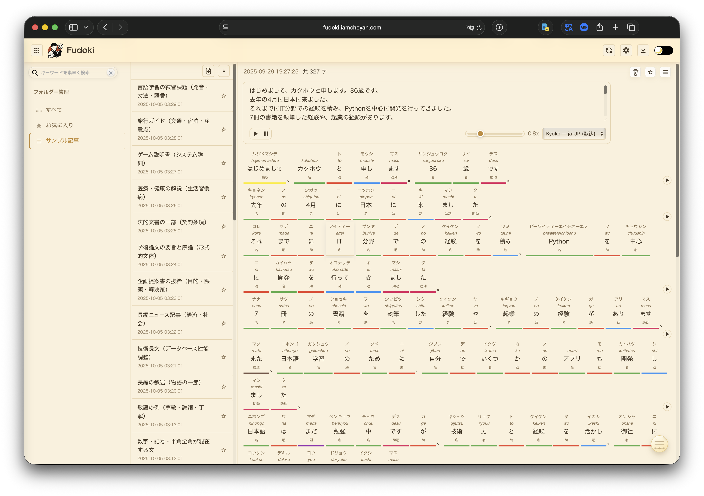

# Fudoki (フドキ)

> 日本語を「見える化」する Web ツール（テキスト解析＆音声読み上げ）
>
> An interactive Japanese text analysis and speech synthesis web app
>
> 让日语结构可视化的 Web 工具（文本分析与语音朗读）



---

## English

### Overview
Fudoki is a browser-based tool that segments Japanese text, shows part-of-speech tags and readings, and reads text aloud via the Web Speech API.

### Features
- Text analysis: Kuromoji.js-based segmentation, POS tags, kana and romaji.
- Speech synthesis: play word/line/all; speed 0.5–2.0; voice selection.
- Playback controls: separate Pause/Resume; Play button shows a stop icon while playing.
- Instant setting changes: changing voice or speed during playback pauses first and then resumes near the current position; settings persist in localStorage.
- Dictionary: JMdict integration; click a word card to view translations.
- Documents: multiple documents, autosave, quick switching.
- UI: dark mode, toggle display options, multilingual interface, draggable toolbar.
- Mobile: on small screens (≤480px) the header speed slider and voice select are compressed in width; left-aligned play buttons and right-aligned controls.

### Usage
Online: https://fudoki.iamcheyan.com

Local:
```bash
python -m http.server 8000
# then open http://localhost:8000
```

### Part-of-Speech Colors
|  | POS |
|---|---|
| 🟢 | Noun |
| 🔵 | Verb |
| 🟠 | Adjective |
| 🟣 | Adverb |
| 🔴 | Particle |
| 🟡 | Interjection |

### Development
```
fudoki/
├── index.html
├── static/
│   ├── main-js.js
│   ├── segmenter.js
│   ├── styles.css
│   └── libs/
│       ├── kuromoji.js
│       └── dict/
│           ├── *.dat.gz
│           └── jmdict_*.json
└── README.md
```

- Update theme colors in `static/styles.css` via CSS variables.
- Place updated JMdict data under `static/libs/dict/`.

### License and Third-party
- MIT License
- Kuromoji.js — Apache License 2.0
- JMdict — Creative Commons Attribution-ShareAlike 3.0

### Contributing and Feedback
Pull requests are welcome. For issues and feature requests, use GitHub Issues: https://github.com/iamcheyan/fudoki/issues

---

## 日本語

### 概要
Fudoki はブラウザで動作する日本語テキスト解析・音声読み上げツールです。Kuromoji.js による分かち書き、品詞、読み（かな・ローマ字）を表示し、Web Speech API で朗読します。

### 主な機能
- 形態素解析：分割、品詞、読み（かな／ローマ字）。
- 音声合成：単語・行・全文の再生、話速 0.5–2.0、音色選択。
- 再生制御：一時停止／再開は専用ボタン。再生中は再生ボタンが停止アイコンになります。
- 設定の即時反映：再生中に音色や話速を変更すると、一度停止してから現在位置付近から新設定で再開します。設定は localStorage に保存されます。
- 辞書：JMdict と連携、単語カードのクリックで訳語を表示。
- 文書管理：複数文書、自動保存、簡易切替。
- UI：ダークモード、表示切替、多言語 UI、ツールバーのドラッグ。
- モバイル：480px 以下では速度スライダーと音色選択の幅を縮小。左に再生ボタン、右に設定。

### 使い方
オンライン：https://fudoki.iamcheyan.com

ローカル：
```bash
python -m http.server 8000
# ブラウザで http://localhost:8000 を開く
```

### 品詞色分け
| 色 | 品詞 |
|---|---|
| 🟢 | 名詞 |
| 🔵 | 動詞 |
| 🟠 | 形容詞 |
| 🟣 | 副詞 |
| 🔴 | 助詞 |
| 🟡 | 感動詞 |

### 開発情報
- テーマカラー：`static/styles.css` の CSS 変数を編集。
- JMdict データ：`static/libs/dict/` に配置。

### ライセンスと利用ライブラリ
- MIT License
- Kuromoji.js — Apache License 2.0
- JMdict — Creative Commons Attribution-ShareAlike 3.0

### 貢献・フィードバック
Issue／PR を歓迎します。https://github.com/iamcheyan/fudoki/issues

---

## 中文

### 概述
Fudoki 是一款基于浏览器的日语文本分析与语音朗读工具。使用 Kuromoji.js 进行分词与词性标注，显示假名和罗马音，并通过 Web Speech API 朗读文本。

### 功能
- 文本分析：分词、词性、假名与罗马音。
- 语音合成：按单词/按行/全文播放；语速 0.5–2.0；音色选择。
- 播放控制：暂停/继续为独立按钮；播放中播放按钮显示“停止”图标。
- 即时设置生效：播放中更改语速或音色，会先暂停再在当前段附近按新设置续播；设置持久化到 localStorage。
- 词典：整合 JMdict；点击词卡查看释义。
- 文档：多文档管理、自动保存、快速切换。
- 界面：暗色模式、显示切换、多语言 UI、工具栏可拖拽。
- 移动端：≤480px 时压缩头部语速滑条与音色下拉宽度；左侧按钮、右侧设置。

### 使用
在线版：https://fudoki.iamcheyan.com

本地运行：
```bash
python -m http.server 8000
# 浏览器访问 http://localhost:8000
```

### 词性颜色
| 颜色 | 词性 |
|---|---|
| 🟢 | 名词 |
| 🔵 | 动词 |
| 🟠 | 形容词 |
| 🟣 | 副词 |
| 🔴 | 助词 |
| 🟡 | 感叹词 |

### 开发信息
- 主题颜色：编辑 `static/styles.css` 中的 CSS 变量。
- JMdict 数据：放置在 `static/libs/dict/`。

### 许可与第三方
- MIT License
- Kuromoji.js — Apache License 2.0
- JMdict — Creative Commons Attribution-ShareAlike 3.0

### 贡献与反馈
欢迎 Issue／PR：https://github.com/iamcheyan/fudoki/issues

---

## Name Origin / 名称の由来 / 名称由来

### English
Fudoki is named in homage to Japan’s ancient regional gazetteers “Fudoki”.
“Fudo” conveys the atmosphere and character of place and culture; “Ki” means to record.
This app similarly “records the climate of language”—prosody, rhythm, phonology, and grammar—by segmenting text, labeling parts of speech and readings, and reassembling it for spoken output. It is not the book itself, but a calm tool inspired by that spirit of attentive recording.

### 日本語
この名称 **フドキ** は、奈良時代の地誌『**風土記（ふどき）**』へのオマージュです。
日本人が「フドキ」と聞くと、多くの場合この古代の記録書を思い出します。そこには土地、暮らし、風俗、文化が静かに、しかし丹念に記されています。

- 「風土」＝地域や文化の空気感・肌ざわり
- 「記」＝記すこと、記録すること

このアプリは、まさに「言葉の風土」を記録し、見える化するための道具です。文を分解し、品詞や読み、音のリズムを捉え、発音として再構成する――それは『風土記』が土地の景色を一つひとつ書き留めた営みによく似ています。歴史書そのものではなく、その精神への敬意としての命名です。

### 中文
**Fudoki（フドキ）** 的名字向日本奈良时代的古代地志《**风土记**》致敬。

- 「风土」＝地域与文化的气息与肌理
- 「记」＝记录、书写

本应用做的，正是“记录语言的风土”：把句子拆解成词语，标注词性与读音，把语感、节奏、声韵与语法结构重新组合，并以语音方式呈现。这与《风土记》逐条记录土地与民俗的工作在结构上高度一致。它不是历史书本身，而是对那种“安静而细致地记录世界”的精神的致敬——让语言的风土逐步显形。

---

## Appendix (Brand & History)

### Brand
<div align="center">

Made with ❤️ for Japanese language learners worldwide

世界中の日本語学習者のために ❤️ を込めて

为全世界的日语学习者用心打造 ❤️

</div>

### Star History

[](https://star-history.com/#iamcheyan/fudoki&Date)